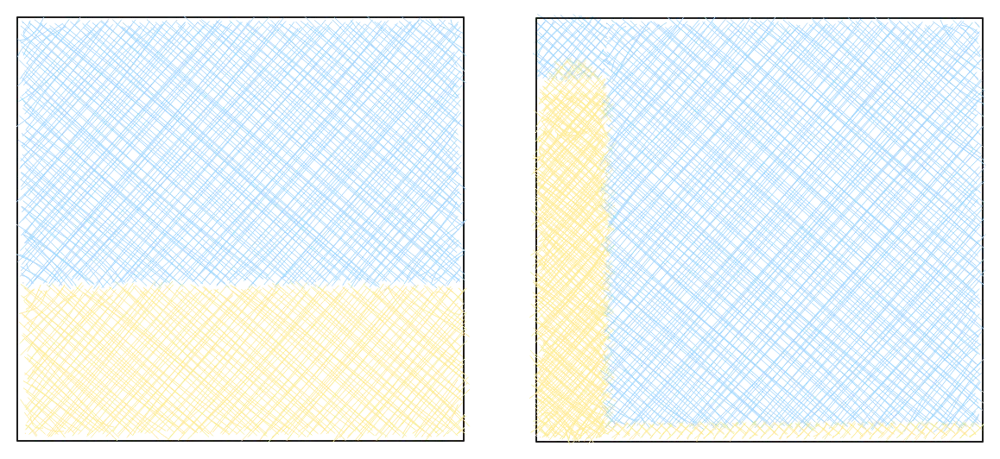

I often see people use statements about entropy as a metaphor for life, paraphrasing the second law of thermodynamic. It goes something like:

 > entropy always increases

followed by some philosophy about embracing disorder or chaos. There's times where these discussions can be well written, but fundamentally I have a problem with them. They are wrong. And in being wrong, they often hide a much better metaphor for life.

Entropy is a weird thing. It's a useful concept for everyday life, but we only learn about it in chemistry. As such, it's badly understood. For me, it took doing a masters in chemistry to start to understand entropy.

I think the main problem is that it's not really explained well, so I'm going to give it a try, then we can come back to our metaphor.

The common definition of entropy goes something like:

 > Entropy is a measure of disorder.

Which is a bad definition. Outside of medical diagnoses, disorder isn't really a common concept. If I asked you the opposite of order, I don't think you'd say order, you'd probably say chaos. And I think when we read disorder we substitute chaos, so lets try that.

 > Entropy is a measure of chaos.

This has two problems. First, chaos means something very specific in science, and it's not this. But more importantly, chaos is a bit vague. If I asked you, what was more chaotic, all your clothes being in a drawer, and then being spread around your house, you'd say the latter. That's good. That's the higher entropy state

But now imagine two beaches. One has a nice even layer of sand, completely flat and uniform. The other has one massive pile of sand in the corner, and the rest is empty. Which is more chaotic?

If you said the second one, yeah, I'd agree with you. But that one is the lower entropy state. So chaos kind of breaks down. In many places we're used to the higher entropy state. It seems less chaotic. But this starts to lead us to a better definition.

 > Entropy is a measure of how spread out things are.

It sounds less precise, but really helps an intuitive understanding of entropy. [^1]

Is everyone stood in the corner of a big room? Low entropy. Are people spread out? High entropy. Does one atom/molecule have loads of energy and the other two don't? High entropy. Is the entropy evenly shared? High entropy. Is 1% of the wealth owned by 1% of people? Low entropy. Is wealth relatively evenly distributed? High entropy.

So lets go back to our low entropy beach. How will the entropy increase? Maybe one day it's windy, and the wind blows some sand about, increasing entropy. Maybe some kids come along and climb the mound, spreading some sand out in the process. Slowly the entropy increases. But what if nobody ever comes along. What if the beach is sheltered from the wind? Maybe the beach never changes.

Well that introduces the first problem with the idea of entropy always increasing. Scientifically, we would couch this with words like "tends" and "as time approaches infinity", but I prefer the statement:

 > Entropy will (probably) always increase.

This definition now captures the intrinsic randomness of the world.

Now, if you were paying attention, you might have noticed one of the examples I gave earlier seems to contradict this statement. But let's focus back to our beach. Imagine our perfectly smooth, high entropy beach, and think what happens if you add a child with a spade.

Suddenly, the sand starts piling up in the corner again. The entropy is decreasing! How is this possible? Well, the second law of thermodynamics has a caveat, which gets omitted when paraphrased. It only applies to an isolated system. That is, a system in which no energy or matter can enter or exit.

This means we can rephrase our statement:

 > Entropy will (probably) always increase, unless you add energy.

Not only is this more scientifically accurate, but it completely changes the metaphor. No longer is it a doomed prophecy about an inevitable fall into chaos, but it becomes a call to action. Entropy is something we can fight against, but it takes energy. Grab a spade!

I've always been particularly inspired by radical hope. That in the face of great odds, great suffering, we can seize on that glimmer of hope. We can take that long shot, we can be the centre back shooting from 45 yards out, and we can be optimistic.

Despair never improved our world, but hope has, and continues to. And we need it now more than ever. We are living in a time when the most powerful country in the world has a fascist government. Where the majority of high income countries are somewhere between passively complicit and actively participating a genocide. Where the most powerful people in our society are waging open hate campaigns against the most vulnerable people in our society. And that is not the even scratching the surface.

All this makes it so easy to despair. To throw your hands up, give up, and declare "well, entropy always increases." But entropy doesn't always increase. And if with only a bit of energy we can stop something as inevitable as entropy, then the fascists stand no chance.

All we need is hope.

---

[^1]: This isn’t exactly a complete definition as there's also a contribution of order. If someone is spread out and in nice little neat lines, it's lower entropy than if it's messy. I was tempted to say "entropy is a measure of how spread out and messy things are", but I think "messy" has loads of frankly nasty cultural connotations and inherits a lot from white supremacist capitalist patriarchy, as well as (small c) conservative ideology. And this is an essay about chemistry, I promise.