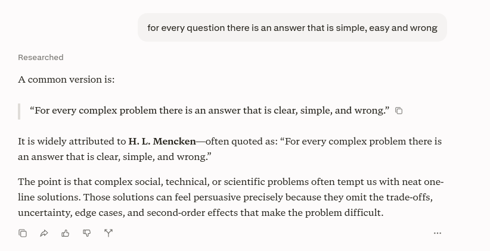
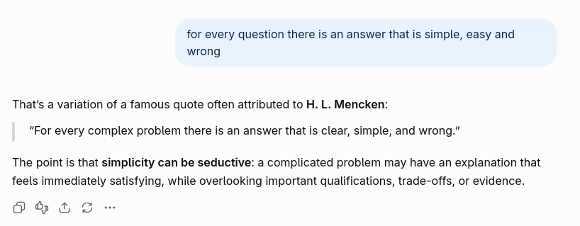
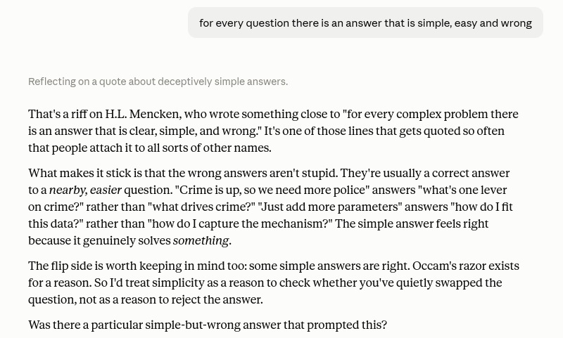
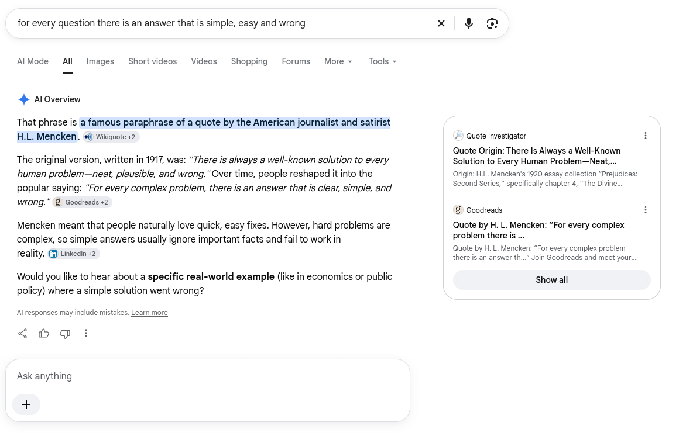
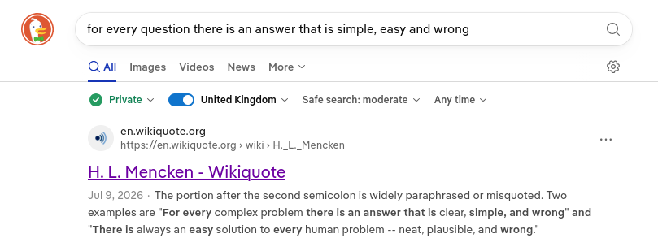

---
tags:
  - writing
pb-type: musing
pb-publish: true
title: LLMs are probably the wrong tool
description: If all you have is an LLM, everything looks like a prompt.
heroImage:
  - - Pasted image 20260930094033.png
pubDate: 30 Sep 26
colour: white
---

Theres a famous misquote of [HL Mencken](https://en.wikiquote.org/wiki/H._L._Mencken#Quotes), which goes:
>  For every complex problem there is an answer that is clear, simple, and wrong.

I offer a collorary to this. In 2026, that answer is probably using an LLM.

Lets start with a meta example. I couldn't quite remember the wording of that quote, nor who said it. To find the answer, I could have asked an LLM. Lets see what they would have said.

Perplexity gave me: 

which gives me the version of the quote, but doesn't tell me its a paraphrasing. I didn't particularly need its commentary on the quote, but fine.

ChatGPT gave me:

which I guess it mentions its a variation of the quote, but I'd have probably missed that.

Claude gives me:

now while I appreciate comrade Claudes subtle implication we should defund the police, this is a terrible answer. Just a block of text, and "something close to"  is doing a lot of heavy lifting.

Nowadays, Google search is just a glorified LLM, so what does that say:

probably the best answer. It picks out the key info, it gives the original with a source, as well as the version I was looking for, with sources and a AI warning. I'm almost impressed.

But again, an LLM is the wrong tool for this job. I needed a search engine. I've become very fond of Duck Duck Go's No AI search option (https://noai.duckduckgo.com). Duck Duck Go gives me all the information I wanted, invites me to click a link to find out more, and does it with maybe an order of magnitude less energy usage[^1]: 

The reason I was originally thinking about this, is I needed to do some image processing. My instinct was to just throw the problem at an LLM. I did, and the LLM did terribly, while burning a terrifying amount of tokens (close to 10% of the 4-hour allowance on Claude Max[^2]). The correct solution turned out to be simple edge detection, the pre-machine learning kind. I could have probably got better results from training a specific Neural Net, but that was too much for the problem. 

It surprised me how quickly I reached for an LLM. This isn't the first time I've got burned by blindly chosing an LLM over what would be a much better tool for the task. I can justify it to myself, as my entire profession has basically gone from "writing code" to "telling an LLM to write code". Still, I should do better.

Maybe this will be useful to someone. If not, here's some predictions I want to write down just in case they are correct:
- There's going to be a AI crash, by this time next year.
- There's going to be a massive recession, possible even a depression, by this time next year[^3].
- By 2030, Dario Amodei will be in jail.
I hope most of them are wrong.

[^1]: There's not an easily quotable source on this. Please don't let me become that.  

[^2]: Yes, I agree, this is a very dumb unit to use. If only Anthopic would stop cancelling IPO's and instead let users know what they're actually paying for.

[^3]: Arguable we're already in a global recession, its just hidden by the insane amounts of AI spending. 
